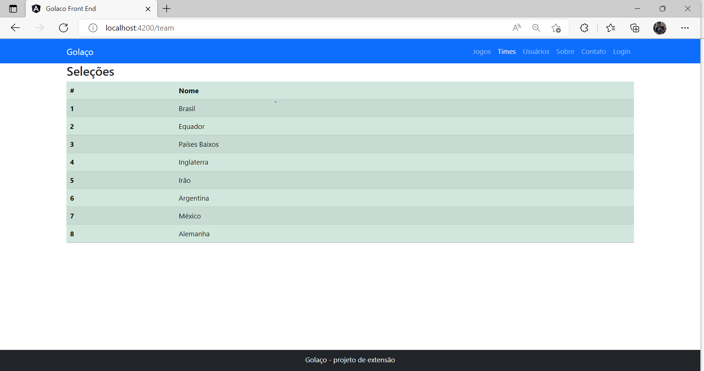
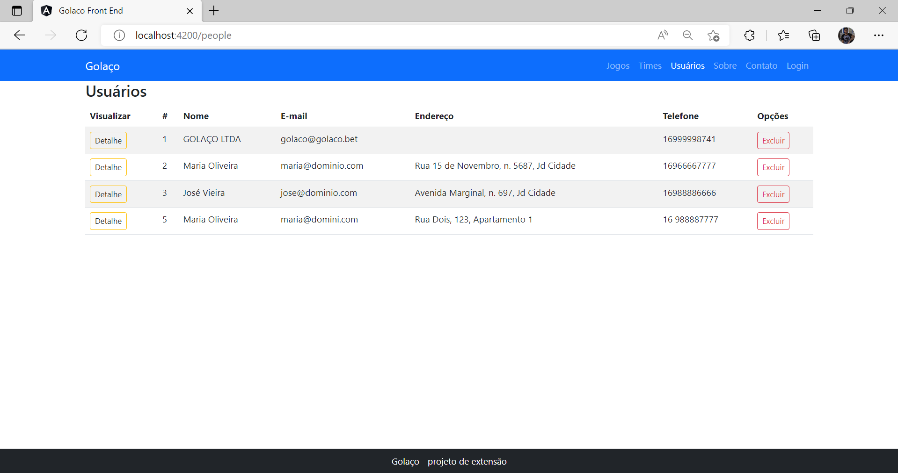
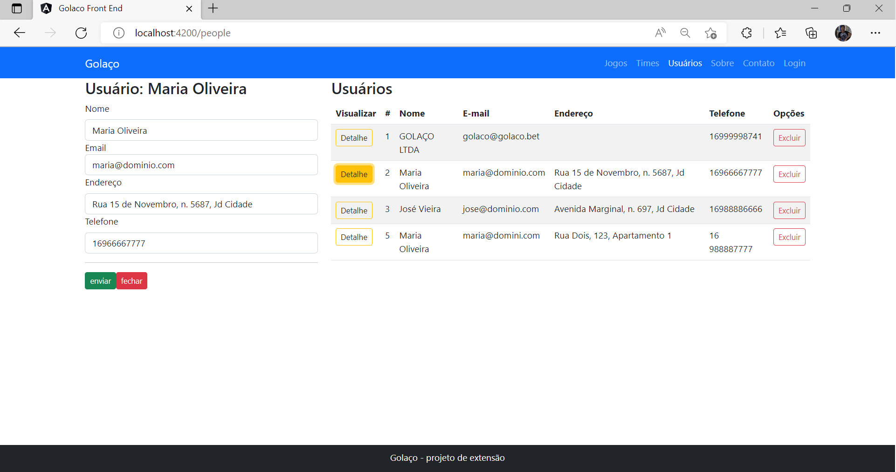

# GolacoFrontEnd

Para rodar o front deve acessar o arquivo src/app-module.ts do back-end. 

Tem que estar parecido com a com a imagem abaixo

Comando para rodar o front é `ng serve` e irá funcionar na rota `http://localhost:4200/`.

## Projeto

o FrontEnd está com muitas deficiências por questões de contra tempo, não consegui realizar e cumprir com a proposta do projeto. 

Foi feito apenas duas telas com o getAll um, um do time, e outro de pessoa.

Times:

Pessoas:

Ao clicar no botão detalhe irá abrir um formulário onde 
supostamente iria poder editar mas não deu tempo de implementar.

apertar em fechar volta normalmente 
a tabela e o restante não 
deu para implementar pois 
tinha que ter 
acesso ao token para poder fazer as outras requições
. 

E infezlimente foi só isso que deu para fazer
na parte do front-end.
